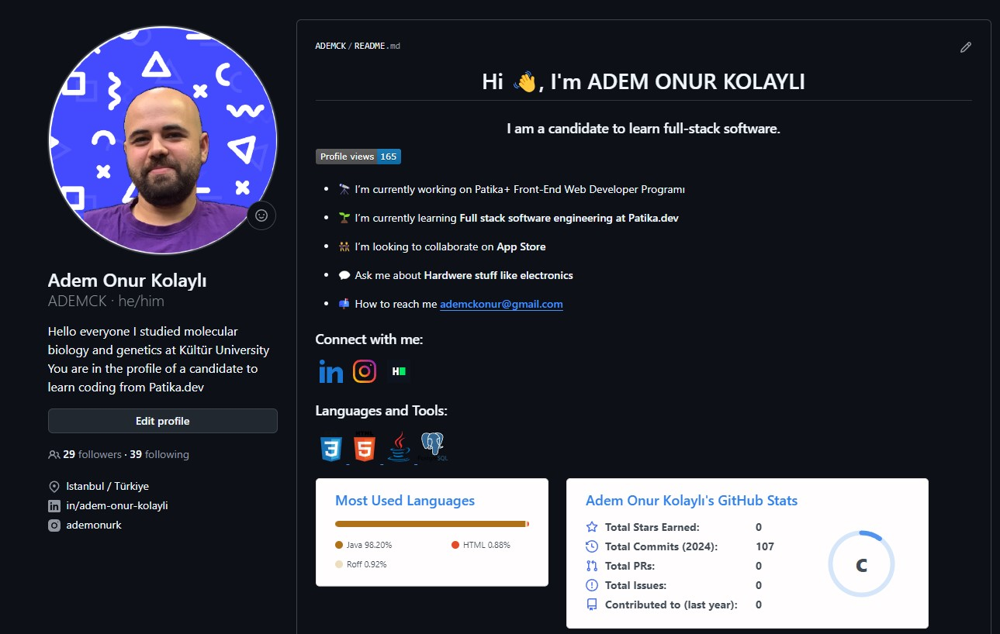

# Kodluyoruz İlk Repo

<<<<<<< HEAD

=======
![Hello to my first repo] (./repo foto.png)
>>>>>>> e70def3388fa185ec3ce8b2b1fbf869bcca084e3

Bu repo, Kodluyoruz Front-End Eğitimi kapsamında oluşturduğumuz ilk repo olup, temel bir web sayfası geliştirme projesidir.

## İçerik
* **README.md:** Bu dosya, repo hakkında genel bilgileri içerir.
* **index.html:** Projenin ana HTML dosyasıdır ve web sayfanızın içeriğini oluşturur.

## Kurulum
1. **Projeyi Klonlama:**
   ```bash
   git clone [https://github.com/ADEMCK/kodluyoruzilkrepo.git](https://github.com/ADEMCK/kodluyoruzilkrepo.git)
